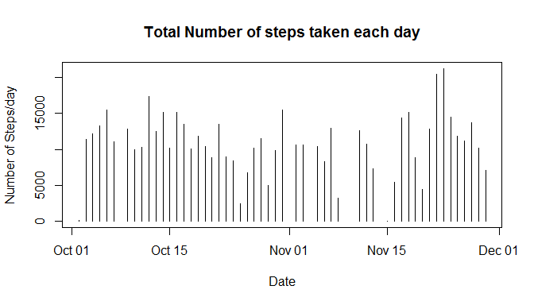
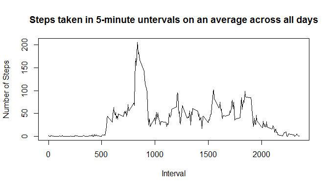
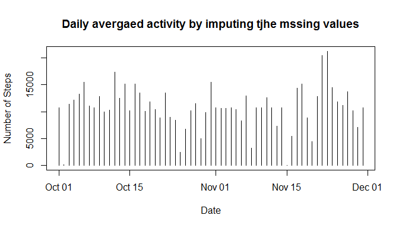
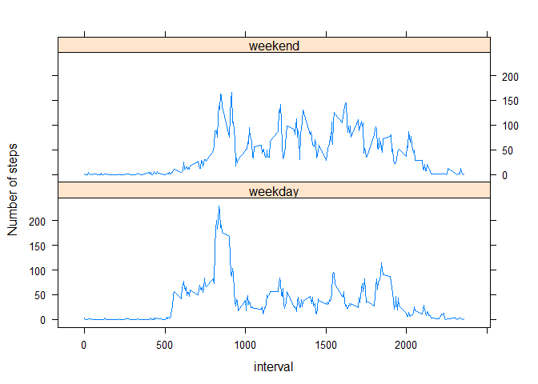

# Reproducible Research: Peer Assessment 1

###Introduction

It is now possible to collect a large amount of data about personal movement using activity monitoring devices such as a Fitbit, Nike Fuelband, or Jawbone Up. These type of devices are part of the "quantified self" movement - a group of enthusiasts who take measurements about themselves regularly to improve their health, to find patterns in their behavior, or because they are tech geeks. But these data remain under-utilized both because the raw data are hard to obtain and there is a lack of statistical methods and software for processing and interpreting the data.

This assignment makes use of data from a personal activity monitoring device. This device collects data at 5 minute intervals through out the day. The data consists of two months of data from an anonymous individual collected during the months of October and November, 2012 and include the number of steps taken in 5 minute intervals each day.

## Loading and preprocessing the data

```r
# opts_chunk$set(echo=TRUE, results = "asis", cache = TRUE)
setwd("C:/Users/Parag/coursera/5/RepData_PeerAssessment1")
if (!file.exists("activity.csv")) {
    unzip(zipfile = "activity.zip")
}
data = read.csv("activity.csv")
data$date = as.Date(data$date)
cdata = na.omit(data)
```
## What is mean total number of steps taken per day?
Ignore the missing values in the dataset:

1. Calculate the total number of steps taken per day
2. Make a histogram of the total number of steps taken each day
3. Calculate and report the mean and median of the total number of steps taken per day


```r
stepsInDay = aggregate(cdata$steps, by = list(cdata$date), FUN = sum)
colnames(stepsInDay) = c("Dates", "Steps")
mean = as.integer(round(sapply(stepsInDay["Steps"], mean)))
median = sapply(stepsInDay["Steps"], median)
plot(x = stepsInDay$Date, y = stepsInDay$Steps, type="h", xlab="Date", 
     ylab="Number of Steps/day", main="Total Number of steps taken each day")
```

 

Average Number of Steps per day:

```
##         Dates Steps
## 1  2012-10-02   126
## 2  2012-10-03 11352
## 3  2012-10-04 12116
## 4  2012-10-05 13294
## 5  2012-10-06 15420
## 6  2012-10-07 11015
## 7  2012-10-09 12811
## 8  2012-10-10  9900
## 9  2012-10-11 10304
## 10 2012-10-12 17382
## 11 2012-10-13 12426
## 12 2012-10-14 15098
## 13 2012-10-15 10139
## 14 2012-10-16 15084
## 15 2012-10-17 13452
## 16 2012-10-18 10056
## 17 2012-10-19 11829
## 18 2012-10-20 10395
## 19 2012-10-21  8821
## 20 2012-10-22 13460
## 21 2012-10-23  8918
## 22 2012-10-24  8355
## 23 2012-10-25  2492
## 24 2012-10-26  6778
## 25 2012-10-27 10119
## 26 2012-10-28 11458
## 27 2012-10-29  5018
## 28 2012-10-30  9819
## 29 2012-10-31 15414
## 30 2012-11-02 10600
## 31 2012-11-03 10571
## 32 2012-11-05 10439
## 33 2012-11-06  8334
## 34 2012-11-07 12883
## 35 2012-11-08  3219
## 36 2012-11-11 12608
## 37 2012-11-12 10765
## 38 2012-11-13  7336
## 39 2012-11-15    41
## 40 2012-11-16  5441
## 41 2012-11-17 14339
## 42 2012-11-18 15110
## 43 2012-11-19  8841
## 44 2012-11-20  4472
## 45 2012-11-21 12787
## 46 2012-11-22 20427
## 47 2012-11-23 21194
## 48 2012-11-24 14478
## 49 2012-11-25 11834
## 50 2012-11-26 11162
## 51 2012-11-27 13646
## 52 2012-11-28 10183
## 53 2012-11-29  7047
```
MEAN - Number of steps per day = 10766  
MEDIAN - Number of steps per day = 10765  

## What is the average daily activity pattern?
1. Make a time series plot if 5-minute interval (x-axis) and the average number of steps taken, averages across all days (y-axis)

2. Calculate the 5-minute interval averaged across all the days which has the maximum number of steps.


```r
fiveMinInt = aggregate(cdata$steps, by = list(cdata$interval), FUN = mean)
colnames(fiveMinInt) = c("interval", "steps")
fiveMinInt["steps"] = sapply(fiveMinInt["steps"], round)
maxStepsInFiveMinInterval = max(fiveMinInt$steps)
timeIntervalOfMaxSteps = fiveMinInt[fiveMinInt$steps==maxStepsInFiveMinInterval , "interval"]
plot(x = fiveMinInt$interval, y=fiveMinInt$steps, type = "l", xlab="Interval", 
     ylab = "Number of Steps", main="Steps taken in 5-minute untervals on an average across all days")
```

 

The time interval for max steps was 835.
The number of steps was 206

##Imputing missing values
Note that there are a number of days/intervals where there are missing values (coded as NA).
The presence of missing days may introduce bias into some calculations or summaries of the
ata. This section does the following:

1. Calculate and report the total number of missing values in the dataset
(i.e. the total number of rows with NAs)
2. Devise a strategy for filling in all of the missing values in the dataset. The strategy does not need to be sophisticated. For example, you could use the mean/median for that day, or the mean for that 5-minute interval, etc.
3. Create a new dataset that is equal to the original dataset but with the missing data filled in.
4. Make a histogram of the total number of steps taken each day and Calculate and report the mean and median total number of steps taken per day. Do these values differ from the estimates from the first part of the assignment? What is the impact of imputing missing data on the estimates of the total daily number of steps?


```r
missingValues = sum(!complete.cases(data))
fdata = data
for (i in 1:nrow(fiveMinInt)) {
    fdata[is.na(fdata$steps) & fdata$interval == fiveMinInt[[i, "interval"]], "steps"] = fiveMinInt[[i, "steps"]]
}
istepsInDay = aggregate(fdata$steps, by = list(fdata$date), FUN = sum)

colnames(istepsInDay) = c("Dates", "Steps")
imeanNumSteps = as.integer(round(sapply(istepsInDay["Steps"], mean)))
imedianNumSteps = as.integer(round(sapply(istepsInDay["Steps"], median)))
plot(x = istepsInDay$Date, y = istepsInDay$Steps, type = "h", xlab= "Date", ylab = "Number of Steps",
                        main = "Daily avergaed activity by imputing tjhe mssing values")
```

 

Number of missing values in teh dataset = 2304  

####After imputing the missing values:
MEAN - Number of steps per day = 10766  
MEDIAN - Number of steps per day = 10762

## Are there differences in activity patterns between weekdays and weekends?
Use the dataset with the filled-in missing values for this part.

Make a panel plot containing a time series plot (i.e. type = "l") of the 5-minute interval (x-axis) and the average number of steps taken, averaged across all weekday days or weekend days (y-axis). 


```r
library(lattice)
wdata = fdata
wdata$date = as.Date(wdata$date)
wdata$DayType = ifelse(weekdays(wdata$date) %in% c("Saturday", "Sunday"), "weekend", "weekday")
wstepsInDay = aggregate(wdata$steps, by = list(wdata$interval, wdata$DayType), FUN = mean)
colnames(wstepsInDay) = c("interval", "DayType", "steps")
wstepsInDay <- transform(wstepsInDay, DayType = factor(DayType) )
xyplot(steps ~ interval | DayType, data = wstepsInDay, layout = c(1, 2), ylab = "Number of steps", type = "l")
```

 


